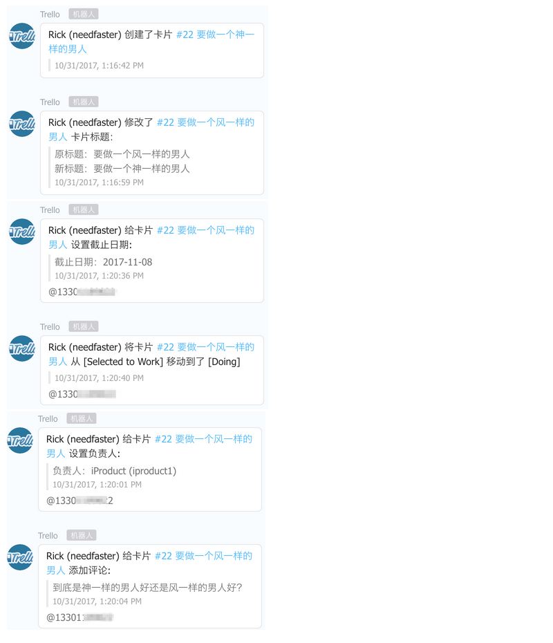
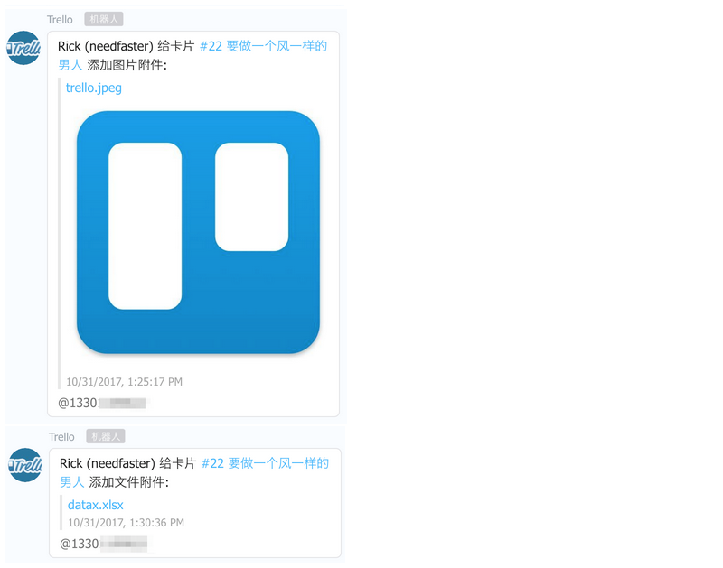

# Integrate DingTalk with Trello

* Trello (https://trello.com) is a great task management online tool. 
* DingTalk (https://www.dingtalk.com/) is a great enterprise IM platform which could have Talkbot(or Chatbot as you like) integrated.

This project tries to integrate the two: You could watch multiple Trello boards you want when you receive the Trello notification you could send it to multiple DingTalk groups as you want according to the configuration.

## Screenshot
Below are the screeshots in the DingTalk group:

 
  

## Prerequisites

Install [Docker](https://www.docker.com/) on your system.

* [Install instructions](https://docs.docker.com/installation/mac/) for Mac OS X
* [Install instructions](https://docs.docker.com/installation/ubuntulinux/) for Ubuntu Linux
* [Install instructions](https://docs.docker.com/installation/) for other platforms

Install [Docker Compose](http://docs.docker.com/compose/) on your system.

* Python/pip: `sudo pip install -U docker-compose`
* Other: ``curl -L https://github.com/docker/compose/releases/download/1.1.0/docker-compose-`uname -s`-`uname -m` > /usr/local/bin/docker-compose; chmod +x /usr/local/bin/docker-compose``
## Step 1 : Add a Talkbot in DingTalk group

see steps in https://open-doc.dingtalk.com/docs/doc.htm?treeId=257&articleId=105735&docType=1 to add a customized  Talkbot, name it "Trello".

## Step 2: set up config.js file

First please copy the `config.example.js` to `config.js`, then set up the configuration content correctly:

- TRELLO_WEBHOOK_URL: Trello will post notification data to this URL, for instance, http://www.example.com/your_trello_callback_url, the request will hit your server
- PORT: Webhook server will listen on this port, request of TRELLO_WEBHOOK_URL will hit this port (there could be NAT port mapping between them)
- TRELLO_API_KEY: <trello API key>, see https://help.datadoghq.com/hc/en-us/articles/115002882826-Use-our-Webhook-Integration-to-create-a-trello-card
- TRELLO_API_TOKEN: <trello API token>
- TRELLO_CLIENT_SECRET: <trello client secret>
- MODELID_SUBSCRIPTIONS: a Hash object, the key is the <trello board ID which you want to watch>, the value is an array of Dingtalk group tokens, with the token you could send the message to the Dingtalk group.

In the `config.example.js`, you have two Trello boards which you want to watch, and you have two DingTalk groups you want to receive the notifications of the two boards in Trello.

## Step 3: set up docker

Run `docker-compose build`. It will

* install all dependencies from the `package.json` locally
* expose port 3000 to the host (depends on your config.js)

## Step 4: Start

Run `docker-compose up` to create and start both `web` container.

Run `node app/bin/www` to start the webhook server.

## Run with forever
RUN `cd /src && forever start -l ~/.forever/forever.log -e ~/.forever/err.log -a app/bin/www`

`forever list`
